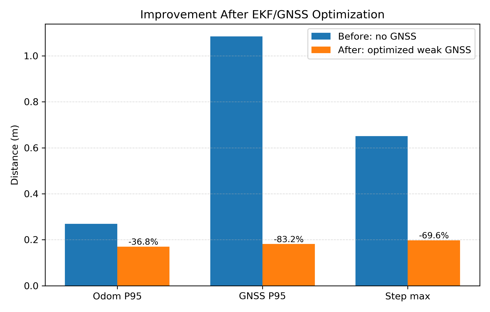
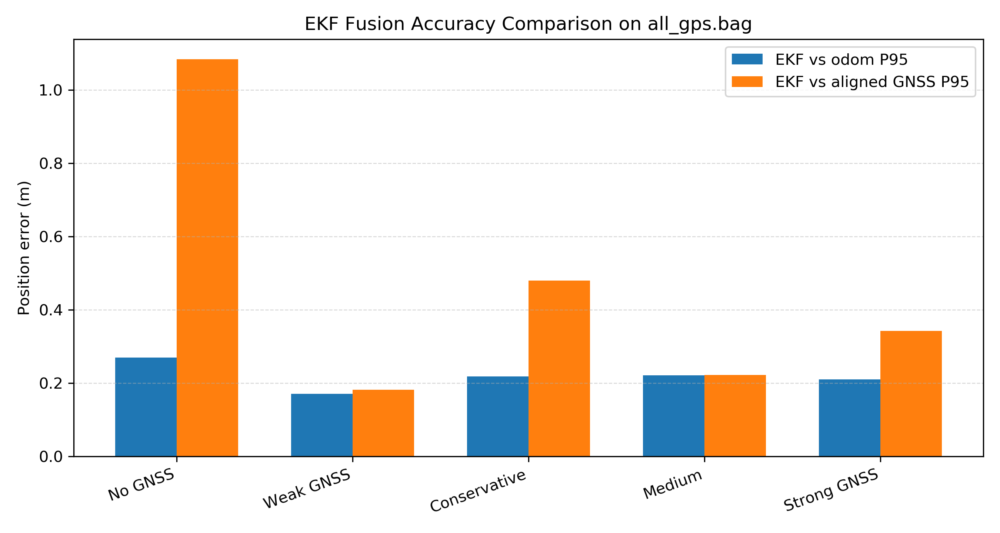
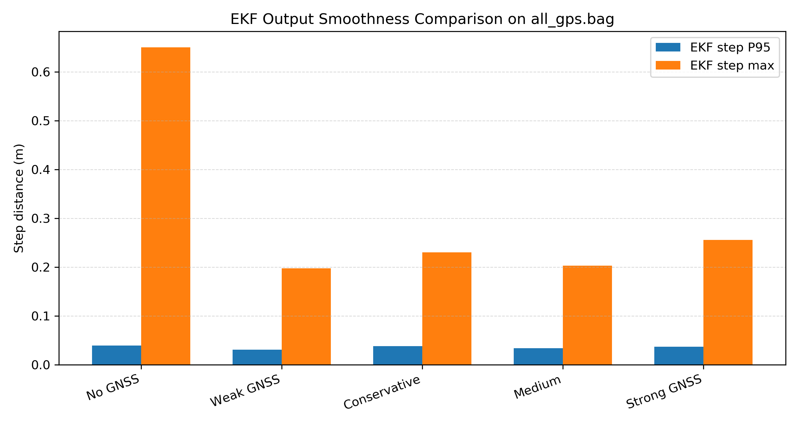

# EKF/GNSS 融合算法改进措施与实验效果分析

更新日期：2026-05-09

当前状态说明：本文档保留早期 `all_gps.bag` GNSS 参数改进实验记录。后续版本已经加入健康观测管理、GNSS yaw+translation 对齐、Mahalanobis/NIS gate、odom/GNSS 一致性健康评分、GNSS cold start 和 odom lost 退化模式，因此早期 `gnss_very_conservative` 参数不再等同于当前 `launch/ekf_lidar.launch` 的全部默认策略。最新工程结果见 `results/engineering_validation/engineering_validation_report.md`，最新分层验证见 `results/layer_validation/validation_report_2026-05-08.md`。

## 1. 改进背景

本项目面向 ROS1 Noetic 环境下的无人机位姿估计任务，核心目标是融合 IMU、里程计 odom 和 GNSS 数据，输出更稳定、更连续的融合位姿。原始 EKF 以 IMU 作为高频预测输入，以 odom 作为主要观测输入，GNSS 作为可选位置观测参与修正。

在实际飞行数据中，odom 通常具有较好的短时连续性，但长期运行时可能存在累计漂移；GNSS 能提供全局位置约束，但频率较低、噪声较大，且短时间内可能出现抖动。因此，如果 GNSS 权重设置过强，融合轨迹容易被 GNSS 噪声拉扯；如果 GNSS 权重过弱，则难以体现全局位置约束作用。本次改进的重点是保持 odom 的短时连续性，同时利用 GNSS 改善长期位置一致性。

## 2. 状态量、输入量和观测量

本次优化没有改变原有 EKF 的状态定义、ROS topic、frame_id 或消息类型，只对滤波器内部数值稳定性、GNSS 参数和评估流程进行改进。

EKF nominal state 为 16 维：

```text
X = [p, q, v, bg, ba]
```

其中：

- `p(0:2)`：三维位置，表示无人机在世界坐标系下的位置。
- `q(3:6)`：姿态四元数，表示机体系相对于世界系的旋转。
- `v(7:9)`：三维速度。
- `bg(10:12)`：陀螺仪零偏。
- `ba(13:15)`：加速度计零偏。

误差状态为 15 维：

```text
delta_x = [dp, dtheta, dv, dbg, dba]
```

其中 `dtheta` 是三维小角度姿态误差。这样做的原因是四元数本身有 4 个参数，但姿态误差实际只有 3 个自由度，因此使用误差状态可以避免直接对四元数做普通加法更新。

输入量为 IMU 数据：

```text
u = [gyro, acc]
```

其中 `gyro` 是角速度，`acc` 是线加速度，对应 6x6 输入噪声矩阵 `Qt`。

观测量包括两类：

- odom 观测：位置和姿态，共 6 维，对应观测噪声矩阵 `Rt`。
- GNSS 观测：只提供三维位置，对应 3x15 的观测矩阵 `H` 和独立的 GNSS 观测噪声矩阵 `R`。

## 3. 本次算法改进措施

### 3.1 姿态预测改为指数映射四元数积分

原始实现中，IMU 角速度对四元数的更新更接近小角度线性积分。该方法在短时间内可以工作，但长时间运行时容易引入四元数归一化误差，进而影响姿态和加速度投影。

本次将姿态预测改为基于角速度指数映射的四元数增量：

```text
delta_theta = omega * dt
delta_q = Exp(delta_theta)
q_new = q_old * delta_q
```

这样可以更符合 SO(3) 旋转群上的姿态传播规律。更新后仍对四元数进行归一化，避免数值误差累积。

### 3.2 修正状态传播函数对全局状态的依赖

原状态传播函数虽然接收一个状态变量作为输入，但内部部分计算仍依赖全局 `X_state`。这会影响前向预测和历史 IMU 重传播，尤其在 time sync 回退更新后重新传播时，可能导致传播状态和期望状态不完全一致。

本次修正后，状态传播函数完全使用传入状态计算 `p, q, v, bg, ba`，使普通预测、ahead prediction 和历史重传播具有一致的状态来源。

### 3.3 协方差更新改为 Joseph form

普通 Kalman 协方差更新常写为：

```text
P = P - K H P
```

该写法计算简单，但在浮点数计算中容易引入协方差矩阵不对称，严重时可能破坏半正定性质。本次 odom update 和 GNSS update 均改为 Joseph form：

```text
P = (I - K H) P (I - K H)^T + K R K^T
```

该形式在数值上更稳定，更适合长期运行的滤波器。预测和更新后还会对协方差做对称化处理：

```text
P = 0.5 * (P + P^T)
```

### 3.4 GNSS 使用弱约束融合

GNSS 数据具有全局参考意义，但噪声和低频特性明显。为了避免 GNSS 将高质量 odom 轨迹拉坏，本次最终采用弱 GNSS 约束：

```text
gnss_min_interval = 1.0 s
gnss_min_cov_xy = 100.0 m^2
gnss_min_cov_z = 144.0 m^2
gnss_innovation_gate = 15.0 m
```

其中 `gnss_min_cov_xy` 和 `gnss_min_cov_z` 是 GNSS 观测协方差下限。数值越大，代表滤波器越不信任 GNSS，GNSS 对状态的拉动越弱。最终选择较大的协方差，是为了让 GNSS 主要承担长期漂移约束，而不是短时强制修正。

### 3.5 增加自动评估流程

为了避免只依赖 RViz 轨迹主观判断，本次新增自动 benchmark 流程。脚本会回放同一个 `all_gps.bag`，比较多组 GNSS 参数，并输出 CSV、LaTeX 表格和论文图片。

评估命令如下：

```bash
scripts/benchmark_gnss_fusion.py all_gps.bag --output /tmp/ekf_fusion_benchmark_all_gps_v2.json
scripts/plot_benchmark_results.py /tmp/ekf_fusion_benchmark_all_gps_v2.json --output-dir results/all_gps_benchmark
```

## 4. 评价指标解释

### 4.1 `ekf_vs_odom`

`ekf_vs_odom` 表示 EKF 输出位置与主 odom 输入位置之间的距离误差。由于 odom 是本系统的主要短时观测源，该指标用于判断融合结果是否破坏了 odom 的短时一致性。

如果该指标过大，说明 EKF 输出偏离 odom 明显，可能存在 GNSS 权重过强、协方差设置不合理或状态传播异常。

### 4.2 `ekf_vs_aligned_gnss`

`ekf_vs_aligned_gnss` 表示 EKF 输出位置与对齐后的 GNSS 位置之间的距离误差。GNSS 经纬高先转换为局部 ENU 坐标，再根据初始 odom 位置做平移对齐。

该指标用于衡量 EKF 轨迹与全局位置约束的一致性。数值越小，说明融合轨迹越接近 GNSS 所提供的全局位置参考。

### 4.3 `ekf_step`

`ekf_step` 表示相邻两帧 EKF 输出位置之间的位移。该指标用于检查输出轨迹是否存在突跳或异常抖动。

其中 `ekf_step max` 是整个 bag 中最大的相邻帧位移。如果该值明显偏大，通常说明滤波器发生了突变修正、reset 或被异常观测拉动。

### 4.4 P95

P95 是 95 分位数。以 `ekf_vs_odom P95 = 0.1700 m` 为例，表示 95% 的 EKF 与 odom 位置误差不超过 0.1700 m。

相比最大值，P95 对个别异常点不那么敏感；相比均值，P95 更能反映大多数情况下的稳定性边界。因此，P95 适合用于论文中描述算法整体鲁棒性。

### 4.5 reset 和 GNSS reject

`reset_count` 表示 EKF 因 odom 跳变或大 innovation 被重置的次数。该值越低，说明滤波过程越连续。

`gnss_reject_count` 表示 GNSS 观测因 innovation 超过门限而被拒绝的次数。该值用于观察 GNSS 是否频繁被判定为离群点。

本次最佳参数下，`reset_count = 0`，`gnss_reject_count = 0`，说明融合过程没有发生强制重置，也没有出现被门限拒绝的 GNSS 离群更新。

## 5. 实验结果

实验数据来自 `all_gps.bag`。对比方法包括不使用 GNSS、弱 GNSS、保守 GNSS、中等 GNSS 和强 GNSS 五组。完整数据见 `fusion_benchmark_metrics.csv`，LaTeX 表格见 `fusion_benchmark_table.tex`。

### 5.1 改进前后核心指标对比



从图中可以看出，优化后的弱 GNSS 融合策略在三个核心指标上均优于未使用 GNSS 的情况：

```text
odom P95:
0.2690 m -> 0.1700 m，降低 36.8%

GNSS P95:
1.0842 m -> 0.1817 m，降低 83.2%

EKF step max:
0.6505 m -> 0.1977 m，降低 69.6%
```

这说明本次优化不仅提高了与 GNSS 全局参考的一致性，也没有牺牲 odom 主观测的一致性，同时显著降低了输出轨迹中的最大突跳。

### 5.2 不同 GNSS 权重下的位置误差对比



图中对比了不同 GNSS 参数组合下的 `ekf_vs_odom P95` 和 `ekf_vs_aligned_gnss P95`。弱 GNSS 约束取得了最好的综合效果：

- `ekf_vs_odom P95 = 0.1700 m`
- `ekf_vs_aligned_gnss P95 = 0.1817 m`

强 GNSS 并没有取得最优效果，说明 GNSS 观测不能简单地赋予过高权重。由于 GNSS 噪声较大，过强的 GNSS 修正会拉扯 EKF 轨迹，使局部连续性下降。

### 5.3 输出平滑性对比



`ekf_step max` 从不使用 GNSS 时的 0.6505 m 降至弱 GNSS 融合后的 0.1977 m。该结果表明，弱 GNSS 约束不仅改善了位置一致性，也降低了 EKF 输出中的最大单步突变。

需要注意的是，`ekf_step P95` 在各组之间差异不如 `ekf_step max` 明显，这说明大多数时刻的短时输出都较平稳；本次优化更主要地改善了少数较大突跳点。

## 6. 最佳参数与效果总结

本次早期实验选出的最佳参数组合为 `gnss_very_conservative`。该组合曾作为阶段性默认参数；2026-05-09 当前默认策略已经升级，详见 `launch/ekf_lidar.launch` 和 `results/engineering_validation/engineering_validation_report.md`。

```text
gnss_min_interval = 1.0
gnss_min_cov_xy = 100.0
gnss_min_cov_z = 144.0
```

该参数组合的核心效果如下：

| 指标 | 不使用 GNSS | 优化后弱 GNSS | 改善幅度 |
| --- | ---: | ---: | ---: |
| `ekf_vs_odom P95` | 0.2690 m | 0.1700 m | 36.8% |
| `ekf_vs_aligned_gnss P95` | 1.0842 m | 0.1817 m | 83.2% |
| `ekf_step max` | 0.6505 m | 0.1977 m | 69.6% |
| `reset_count` | 0 | 0 | 无 reset |
| `gnss_reject_count` | 0 | 0 | 无 GNSS reject |

综合来看，本次算法改进达到了三个目标：

1. 保持 odom 主观测一致性，避免 GNSS 过强导致轨迹被拉扯。
2. 利用 GNSS 提供长期位置约束，显著降低 EKF 与全局位置参考之间的偏差。
3. 改善输出轨迹的平滑性，降低最大相邻帧突跳。

因此，本次改进可以概括为：在保持原有 ROS 接口和 EKF 状态结构不变的前提下，通过更稳定的姿态传播、更稳健的协方差更新和弱 GNSS 约束参数，实现了更稳定、更一致的 IMU/odom/GNSS 融合定位效果。
