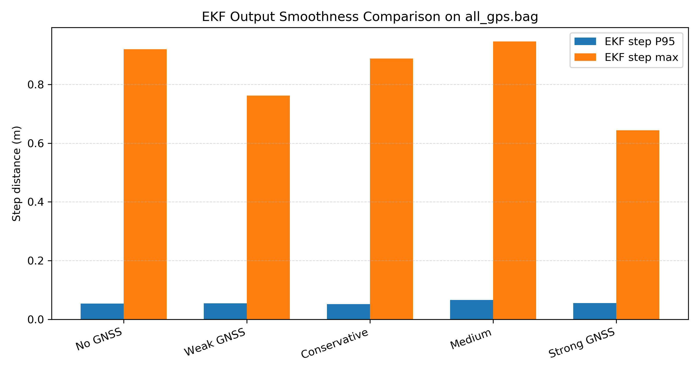
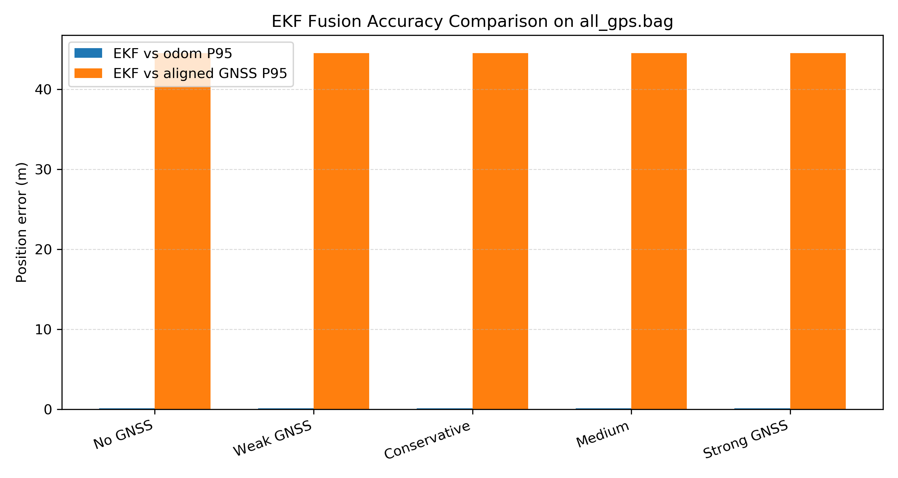
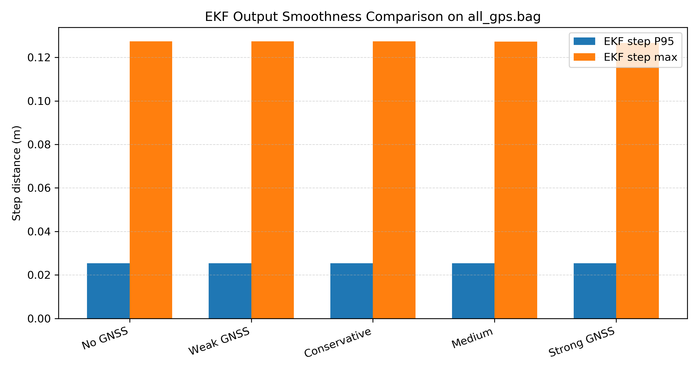
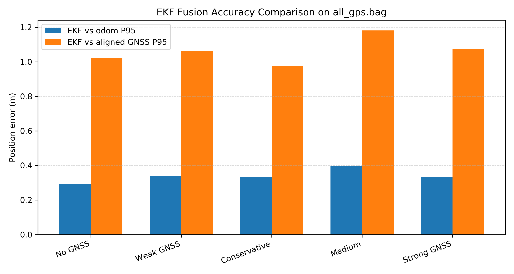

# 复杂遮挡环境下飞行器连续稳定定位技术

作者：李志成  
指导教师：陈汉  
单位：无人系统研究院  
论文类型：本科毕业设计（论文）  
英文题目：Continuous and Stable Positioning Technology for UAVs in Complex Occlusion Environments

## 摘要

复杂遮挡环境下的无人机定位容易受到全球导航卫星系统（Global Navigation Satellite System，GNSS）信号遮挡、多径误差、视觉/激光里程计漂移以及惯性器件零偏累积等因素影响。单一定位源难以同时满足连续性、精度和鲁棒性要求，尤其在城市峡谷、林下遮挡和临时信号中断等场景中，定位误差可能在短时间内迅速放大，进而影响飞行器自主导航与任务执行安全。针对上述问题，本文围绕“复杂遮挡环境下飞行器连续稳定定位”这一目标，研究并实现了一种基于扩展卡尔曼滤波（Extended Kalman Filter，EKF）的多源定位融合方法。

本文首先建立了以惯性测量单元（Inertial Measurement Unit，IMU）为预测输入，以里程计（可对应视觉里程计、激光里程计或 MAVROS 局部里程计）和 GNSS 为观测输入的误差状态 EKF 模型。系统名义状态由位置、姿态四元数、速度、陀螺仪零偏和加速度计零偏组成，误差状态由位置误差、姿态小角度误差、速度误差及两类零偏误差组成。其次，针对多源传感器频率不一致和时间戳异步问题，本文在 ROS1 Noetic 环境下构建了 IMU 高频预测、里程计事件触发更新和 GNSS 低频位置更新的多速率融合框架，并通过 IMU 历史缓存回退与重传播实现观测时刻对齐。再次，针对 GNSS 离群、里程计坐标跳变等异常情况，本文设计了基于新息序列、马氏距离/NIS 门限、运动一致性和传感器健康评分的自适应观测管理机制，在异常发生时通过放大观测噪声协方差或拒绝离群观测实现软隔离。最后，针对运动中初始化和 GNSS/map 坐标对齐问题，本文采用短窗口 GNSS-里程计配对样本估计 yaw 与平移关系，为绝对观测引导的快速初始化提供工程化实现。

实验部分基于 ROS bag 回放、自动 benchmark 和公共数据集验证完成。健康数据 `all_gps.bag` 的工程评估表明，保守 GNSS 参数下系统能够完成 1 次 yaw 与平移对齐，GNSS 无误拒绝，黄色 GNSS path 与 EKF path 的 95% 分位误差约为 0.6630 m，reset 次数为 0。异常数据 `new_data.bag` 实验表明，在原始里程计存在 4 次坐标跳变、GNSS 与局部坐标存在明显系统偏差时，本文方法能够触发 4 次 odom 重对齐，保持 reset 次数为 0，EKF 最大单步位移约 0.127 m，并自动拒绝约 112 次异常 GNSS 更新。公共 RSSI/RTK 数据集验证表明，在 6 段公开序列上 EKF 相对 RTK 的 P95 误差约为 1.19-1.35 m，reset 均为 0；普通 GPS 对 RTK 精度提升有限，因此 GNSS 应作为保守辅助约束而非强制主观测。实验结果说明，本文方法能够在健康观测下保持位置一致性，在异常观测下保持输出连续性和工程可用性。

关键词：复杂遮挡环境；无人机定位；扩展卡尔曼滤波；GNSS；IMU；里程计；新息监测；自适应融合

## Abstract

Positioning of unmanned aerial vehicles in complex occlusion environments is strongly affected by GNSS blockage, multipath errors, odometry drift and inertial sensor bias. A single positioning source is usually unable to provide accuracy, continuity and robustness at the same time. To address this problem, this thesis studies a multi-source positioning fusion method based on the Extended Kalman Filter (EKF). The proposed system uses IMU measurements for high-rate prediction, odometry measurements for pose correction, and GNSS measurements as low-rate absolute position constraints.

The nominal state contains position, quaternion attitude, velocity, gyroscope bias and accelerometer bias. The error state contains position error, small-angle attitude error, velocity error and bias errors. A multi-rate asynchronous fusion framework is implemented in ROS1 Noetic. IMU propagation is executed at high frequency, while odometry and GNSS updates are triggered by observation events. To improve robustness, innovation-based health monitoring, Mahalanobis/NIS gating, motion consistency checking and adaptive observation covariance scaling are introduced. Abnormal measurements are weakened or rejected instead of directly resetting the filter. For motion initialization and GNSS/map alignment, a short-window yaw and translation alignment method is used to provide a practical implementation of absolute-observation-guided initialization.

Experiments are carried out with ROS bag replay, automatic benchmark scripts and public-dataset validation. On the healthy `all_gps.bag` dataset, the conservative GNSS setting completes one yaw-and-translation alignment without false GNSS rejection, keeps zero reset, and achieves a 95th percentile distance of about 0.6630 m between the published GNSS path and the EKF path. On the abnormal `new_data.bag` dataset, where odometry has four coordinate jumps and GNSS has obvious systematic bias, the proposed method triggers four odometry realignments, keeps zero reset, maintains a maximum EKF step of about 0.127 m, and rejects about 112 abnormal GNSS updates. Public RSSI/RTK validation further shows that the EKF keeps 1.19-1.35 m 95th percentile error to RTK over six sequences with zero reset, while regular GPS provides only marginal improvement. The results show that the proposed method can maintain consistency under healthy observations and preserve trajectory continuity under abnormal observations.

Key words: UAV positioning; complex occlusion environment; Extended Kalman Filter; GNSS; IMU; odometry; innovation monitoring; adaptive fusion

# 第一章 绪论

## 1.1 研究背景与意义

无人机具有机动灵活、部署便捷和作业成本低等特点，已在城市巡检、应急救援、农林作业、低空测绘和自主运输等领域得到广泛应用。随着任务场景从开阔区域逐渐扩展到高楼林立城区、树林遮挡区域、桥洞附近以及灾后复杂环境，定位系统面临的外部条件明显恶化。传统依赖 GNSS 的定位方式在开阔环境中能够提供较稳定的全局位置，但在复杂遮挡环境中易出现信号中断、可见卫星数减少、多径反射和定位跳变等问题。当 GNSS 观测长期不可用或短时产生米级离群误差时，飞行器若缺少可靠的冗余定位源，可能出现轨迹发散、控制输入异常甚至任务中断。

IMU 能以较高频率输出角速度和线加速度，是飞行器短时间运动预测的重要信息来源。然而，低成本 IMU 存在零偏、随机游走和积分漂移，仅依赖惯性递推会使位置误差随时间快速累积。视觉里程计、激光里程计或 MAVROS 局部里程计能够提供较平滑的相对运动信息，在 GNSS 缺失时可以弥补纯惯性递推的漂移，但这类相对定位源也可能受到纹理缺失、光照变化、运动模糊、点云退化和局部坐标系跳变等因素影响。由此可见，复杂遮挡环境下的连续稳定定位问题本质上是多源异构观测在不确定可靠性条件下的状态估计问题。

扩展卡尔曼滤波（Extended Kalman Filter，EKF）能够在非线性系统中通过状态预测、观测线性化和协方差传播实现递推估计，是 GNSS/INS、视觉惯性融合和移动机器人定位中常用的融合框架。与单一传感器方案相比，多源 EKF 能够利用 IMU 的高频连续性、里程计的局部平滑性和 GNSS 的全局约束性，在理论上具备更好的互补性。但在真实复杂环境中，EKF 的性能高度依赖观测质量和噪声协方差设置。一旦异常观测被滤波器错误信任，卡尔曼增益会将状态拉向错误位置，导致融合结果比单一健康传感器更差。因此，复杂遮挡环境下不仅需要“融合”，更需要“有选择、有权重、有健康判断地融合”。

本文研究具有以下意义。第一，面向城市峡谷和林下遮挡等低空应用瓶颈，构建能够在 GNSS 不稳定条件下持续输出位姿的融合定位框架，有助于提高无人机复杂环境自主作业能力。第二，面向应急救援和灾后勘察任务，提升系统在观测源异常时的连续定位能力，可降低任务中断和飞行安全风险。第三，面向农林作业和巡检场景，利用 GNSS、IMU 与里程计互补特性，有助于降低对高成本导航设备的依赖。第四，从工程实现角度，本文在 ROS1 Noetic 平台上完成算法集成、可视化和自动评估，为后续实机验证和参数固化提供基础。

## 1.2 国内外研究现状

围绕多传感器融合与复杂环境定位，国内外研究主要集中在 EKF 融合框架、多速率异步数据处理、无人机/移动平台融合定位以及异常观测处理等方面。

在多传感器融合与 EKF 通用框架方面，Simanek 等人（2015）对移动机器人数据融合中的 EKF 估计架构进行了系统评估，指出基于非线性模型和互补滤波思想的 EKF 架构能够在实时车载处理条件下取得较好的定位性能[22]。Lin 和 Hsueh（2013）提出自适应 EKF-CMAC 多传感器融合方法，用于机动目标跟踪，体现了自适应机制与 EKF 结合对动态目标估计的价值[23]。Liu 等人（2016）在结构健康监测中提出融合位移和加速度观测的 EKF-UI 方法，证明多类型观测可有效抑制单一观测带来的漂移[20]。国内方面，戚振彪等人（2026）针对多源量测时间戳不同步和不良数据问题，提出基于动态时间规整（Dynamic Time Warping，DTW）和自适应异常检测的 EKF 状态估计方法[1]；李志鹏（2024）在无人机相对定位研究中利用 EKF 新息构建自适应判决规则，以提高状态突变下的估计精度[3]。这些研究表明，EKF 仍是多源融合中的重要递推估计框架，而时间同步、异常检测和自适应协方差调节是提升 EKF 工程鲁棒性的关键环节。

在多速率和异步融合方面，马倩等人（2025）针对配网自动化设备多源数据速率不同的问题，采用 UKF 数据融合方法进行状态评估[2]。Yang Li 等人（2025）将 EKF-UI 与多速率数据融合技术结合，用于结构响应和地震荷载识别，说明异构传感器不同采样率处理不仅存在于电力和结构监测领域，也对无人机 IMU、GNSS 和里程计融合具有参考意义[8]。Lee 和 Gao（2019）针对多传感器时延系统提出改进 CI-EKF 融合算法，关注时延条件下协方差一致性和计算复杂度[17]。这些工作说明，传感器频率差异、时延和时间戳不一致会直接影响融合精度，必须在系统设计中显式处理。

在无人机和移动平台应用方面，Zhou 等人（2021）提出基于 EKF 的多数据融合方法，融合 IMU、里程计和激光雷达数据，实现移动机器人室内定位[15]。Azarbeik 等人（2023）比较 EKF 和平方根无迹卡尔曼滤波（Square Root Unscented Kalman Filter，SRUKF）在 IMU 与 SLAM 融合中的性能，指出 EKF 在计算效率和估计精度之间具有较好平衡[12]。国内方面，王庆贺等人（2016）设计基于 EKF 的多旋翼无人机定位控制器，将惯性数据、高度数据与视觉标签数据融合，显著提高室内定位精度[18]。李健平（2021）围绕轻小型无人机 LiDAR 平台开展多源数据融合定位定姿研究，利用高频 IMU 与其他观测紧密融合，提高低空无人机定位定姿精度[16]。李飞等人（2025）将轮式里程计和 IMU 进行 EKF 融合，再与视觉信息进行非线性优化耦合，以减少移动机器人运动漂移[7]。王庆辉等人（2025）利用 EKF 融合里程计和 IMU，为 2D 激光 SLAM 提供更准确的初始位姿估计[9]。

在卫星拒止和替代定位源融合方面，李宗锦等人（2025）设计 UWB/IMU 融合定位系统，以弥补单一 UWB 定位抖动和 IMU 漂移问题[5]。王少杰（2025）研究卫星拒止环境下 UWB/IMU 融合定位算法，表明 EKF 和 UKF 均能提高单一传感器定位精度[6]。吕涛等人（2016）在农用无人机定位中融合 GPS、INS 和光流传感器，提高三维空间位置和速度估计精度[19]。这些研究进一步说明，在 GNSS 不可靠或拒止环境中，引入自主传感器并进行滤波融合是提高连续定位能力的主要技术路径。

综上，已有研究已经证明 EKF 多源融合在无人机和移动机器人定位中的有效性，但仍存在三方面不足。第一，部分研究更关注正常观测下的精度提升，对 GNSS 多径、里程计坐标跳变和异常观测误融合问题考虑不足。第二，许多方法在理论或仿真层面验证较多，面向 ROS 工程系统的自动评估、参数对比和异常日志统计不够完整。第三，运动中初始化、GNSS 与局部里程计坐标对齐以及观测源健康管理往往被分散处理，尚需形成面向复杂遮挡环境的统一工程框架。本文在已有研究基础上，将多速率 EKF 融合、新息健康监测、自适应观测协方差和短窗口绝对观测对齐进行集成，以提高飞行器定位的连续性和稳定性。

## 1.3 论文研究内容与结构安排

本文围绕复杂遮挡环境下飞行器连续稳定定位问题，主要研究内容如下。

第一，构建多速率误差状态 EKF 融合框架。系统以 IMU 作为高频预测输入，以里程计位姿作为主要观测，以 GNSS 位置作为低频全局冗余约束。状态量包含位置、姿态四元数、速度、陀螺仪零偏和加速度计零偏，协方差定义在 15 维误差状态上。

第二，设计面向异步观测的时间对齐和更新调度机制。针对 IMU、里程计和 GNSS 频率不同的问题，系统采用 IMU 历史缓存、观测时刻回退更新和重传播策略，使观测尽可能作用于正确的状态时刻。

第三，提出基于新息监测的观测源健康管理方法。系统对 odom residual、GNSS residual、马氏距离/NIS、GNSS 运动一致性和观测协方差进行综合判断，在异常时通过放大观测噪声协方差、弱化观测或拒绝观测保持 EKF 输出连续。

第四，研究绝对观测引导的短窗口快速初始化与坐标对齐方法。系统利用 GNSS 与 odom 在短时间窗口内的配对运动估计 yaw 与平移关系，实现 GNSS ENU 坐标到 odom/map 坐标的对齐；当 odom 坐标跳变时，通过重对齐避免 EKF 直接 reset。

第五，搭建 ROS1 Noetic 工程验证平台，并基于健康数据和异常数据进行自动 benchmark。实验指标包括 EKF 与 odom 误差、EKF 与对齐 GNSS 误差、EKF 相邻输出最大步长、reset 次数、odom 重对齐次数和 GNSS 拒绝次数。

全文结构如下：第一章介绍研究背景、国内外现状和论文结构；第二章建立坐标系、状态模型、观测模型和 EKF 理论基础；第三章阐述多源异步观测的自适应 EKF 融合框架；第四章介绍基于新息监测的异常检测和自适应融合策略；第五章研究绝对观测引导的滑动窗口快速初始化与坐标对齐；第六章给出系统集成与实验分析；第七章总结全文并展望后续工作。

# 第二章 系统建模与理论基础

## 2.1 坐标系定义与符号约定

本文使用的主要坐标系包括世界坐标系、机体系和传感器坐标系。世界坐标系记为 $W$，在工程实现中对应 ROS 中的 `map` 或局部 ENU 坐标系。机体系记为 $B$，通常与 IMU 坐标系近似一致。GNSS 天线、视觉/激光里程计和 IMU 之间可能存在外参平移和旋转，若无明确标定结果，则工程实现中将 odom 观测视为已经表达在统一世界坐标系下的机体位姿。

无人机在世界坐标系下的位置为 $\mathbf{p}\in\mathbb{R}^3$，速度为 $\mathbf{v}\in\mathbb{R}^3$，姿态采用单位四元数 $\mathbf{q}=[q_w,q_x,q_y,q_z]^T$ 表示。四元数对应旋转矩阵记为 $\mathbf{R}(\mathbf{q})$。IMU 角速度和加速度测量分别记为 $\boldsymbol{\omega}_m$ 和 $\mathbf{a}_m$，陀螺仪零偏与加速度计零偏分别记为 $\mathbf{b}_g$ 和 $\mathbf{b}_a$。

本文采用名义状态和误差状态分离的误差状态 EKF。名义状态定义为

$$
\mathbf{X}=
\begin{bmatrix}
\mathbf{p}^T & \mathbf{q}^T & \mathbf{v}^T & \mathbf{b}_g^T & \mathbf{b}_a^T
\end{bmatrix}^T
\in \mathbb{R}^{16}
\tag{2-1}
$$

误差状态定义为

$$
\delta\mathbf{x}=
\begin{bmatrix}
\delta\mathbf{p}^T & \delta\boldsymbol{\theta}^T & \delta\mathbf{v}^T &
\delta\mathbf{b}_g^T & \delta\mathbf{b}_a^T
\end{bmatrix}^T
\in \mathbb{R}^{15}
\tag{2-2}
$$

其中 $\delta\boldsymbol{\theta}$ 是三维小角度姿态误差。名义状态中四元数为 4 维，但姿态误差实际只有 3 个自由度，因此协方差矩阵 $\mathbf{P}$ 定义在 15 维误差状态上，而不是直接定义为 16 维状态协方差。该处理可避免四元数单位约束与普通向量加法更新之间的矛盾。

向量叉乘矩阵记为 $[\cdot]_\times$。对于任意 $\mathbf{a},\mathbf{b}\in\mathbb{R}^3$，有 $[\mathbf{a}]_\times\mathbf{b}=\mathbf{a}\times\mathbf{b}$。重力向量记为 $\mathbf{g}$，在 ENU 坐标系中可写为 $\mathbf{g}=[0,0,9.8]^T$ 或按实现中的符号约定加入状态传播方程。

## 2.2 IMU 运动学与状态递推模型

IMU 测量模型可表示为

$$
\boldsymbol{\omega}_m=\boldsymbol{\omega}+\mathbf{b}_g+\mathbf{n}_g
\tag{2-3}
$$

$$
\mathbf{a}_m=\mathbf{a}+\mathbf{b}_a+\mathbf{n}_a
\tag{2-4}
$$

其中 $\mathbf{n}_g$ 和 $\mathbf{n}_a$ 分别为陀螺仪和加速度计测量噪声。零偏采用随机游走模型：

$$
\dot{\mathbf{b}}_g=\mathbf{n}_{bg},\quad
\dot{\mathbf{b}}_a=\mathbf{n}_{ba}
\tag{2-5}
$$

在离散时刻 $k$ 到 $k+1$，采样间隔为 $\Delta t$，系统使用 IMU 测量完成状态预测。去零偏角速度和加速度为

$$
\hat{\boldsymbol{\omega}}_k=\boldsymbol{\omega}_{m,k}-\mathbf{b}_{g,k}
\tag{2-6}
$$

$$
\hat{\mathbf{a}}_k=\mathbf{a}_{m,k}-\mathbf{b}_{a,k}
\tag{2-7}
$$

位置、速度和姿态递推为

$$
\mathbf{p}_{k+1}=\mathbf{p}_{k}
+\mathbf{v}_{k}\Delta t
+\frac{1}{2}\left(\mathbf{R}(\mathbf{q}_k)\hat{\mathbf{a}}_k-\mathbf{g}\right)\Delta t^2
\tag{2-8}
$$

$$
\mathbf{v}_{k+1}=\mathbf{v}_{k}
+\left(\mathbf{R}(\mathbf{q}_k)\hat{\mathbf{a}}_k-\mathbf{g}\right)\Delta t
\tag{2-9}
$$

$$
\mathbf{q}_{k+1}=\mathbf{q}_k\otimes \mathrm{Exp}\left(\hat{\boldsymbol{\omega}}_k\Delta t\right)
\tag{2-10}
$$

其中 $\otimes$ 表示四元数乘法，$\mathrm{Exp}(\cdot)$ 表示从李代数 $\mathfrak{so}(3)$ 到单位四元数或旋转群 $SO(3)$ 的指数映射。工程实现中采用指数映射更新四元数，并在每次预测后进行归一化，以降低长时间积分中的数值误差。

误差状态协方差递推为

$$
\mathbf{P}_{k+1}=\mathbf{F}_k\mathbf{P}_{k}\mathbf{F}_k^T+
\mathbf{G}_k\mathbf{Q}_k\mathbf{G}_k^T
\tag{2-11}
$$

其中 $\mathbf{F}_k$ 为误差状态转移矩阵，$\mathbf{G}_k$ 为噪声输入矩阵，$\mathbf{Q}_k$ 为 IMU 输入噪声协方差。本文工程实现中 $\mathbf{Q}_k$ 为 6 维输入噪声矩阵，对应

$$
\mathbf{u}_k=
\begin{bmatrix}
\boldsymbol{\omega}_{m,k}^T & \mathbf{a}_{m,k}^T
\end{bmatrix}^T
\tag{2-12}
$$

即前三维为角速度噪声，后三维为加速度噪声。预测和更新后对 $\mathbf{P}$ 做对称化处理：

$$
\mathbf{P}\leftarrow \frac{1}{2}\left(\mathbf{P}+\mathbf{P}^T\right)
\tag{2-13}
$$

该步骤可减小浮点计算造成的非对称误差。

## 2.3 多源观测模型

### 2.3.1 里程计位姿观测模型

里程计观测可以来自视觉里程计、激光里程计、VIO/LIO 或 MAVROS 局部里程计。本文 ROS 工程中主要使用 `nav_msgs/Odometry` 类型作为 odom 观测输入，观测量包括位置和姿态：

$$
\mathbf{z}_{odom}=
\begin{bmatrix}
\mathbf{p}_{odom}^T & \boldsymbol{\theta}_{odom}^T
\end{bmatrix}^T
\tag{2-14}
$$

位置残差为

$$
\mathbf{r}_p=\mathbf{p}_{odom}-\hat{\mathbf{p}}
\tag{2-15}
$$

姿态残差采用李代数误差表示：

$$
\mathbf{r}_q=
\mathrm{Log}\left(\hat{\mathbf{R}}^T\mathbf{R}_{odom}\right)
\tag{2-16}
$$

因此 odom 总残差为

$$
\mathbf{r}_{odom}=
\begin{bmatrix}
\mathbf{r}_p^T & \mathbf{r}_q^T
\end{bmatrix}^T
\tag{2-17}
$$

其观测矩阵可近似写为

$$
\mathbf{H}_{odom}=
\begin{bmatrix}
\mathbf{I}_{3} & \mathbf{0}_{3} & \mathbf{0}_{3} & \mathbf{0}_{3} & \mathbf{0}_{3}\\
\mathbf{0}_{3} & \mathbf{I}_{3} & \mathbf{0}_{3} & \mathbf{0}_{3} & \mathbf{0}_{3}
\end{bmatrix}
\tag{2-18}
$$

观测噪声矩阵 $\mathbf{R}_{odom}$ 为 6 维，对应位置三维和姿态误差三维。在工程参数中，位置观测噪声、roll/pitch 姿态观测噪声和 yaw 姿态观测噪声分别配置，以适应不同里程计源的可靠性差异。

### 2.3.2 GNSS 位置观测模型

GNSS 输入采用 `sensor_msgs/NavSatFix`，包含纬度、经度、高度及位置协方差。系统首先将经纬高转换为局部 ENU 米制坐标，再通过与 odom/map 坐标系的平移和 yaw 对齐得到 GNSS 在世界坐标系下的位置观测 $\mathbf{p}_{gnss}^{W}$。GNSS 位置观测模型为

$$
\mathbf{z}_{gnss}=\mathbf{p}+\mathbf{n}_{gnss}
\tag{2-19}
$$

残差为

$$
\mathbf{r}_{gnss}=\mathbf{z}_{gnss}-\hat{\mathbf{p}}
\tag{2-20}
$$

观测矩阵为

$$
\mathbf{H}_{gnss}=
\begin{bmatrix}
\mathbf{I}_3 & \mathbf{0}_3 & \mathbf{0}_3 & \mathbf{0}_3 & \mathbf{0}_3
\end{bmatrix}
\tag{2-21}
$$

即 GNSS 只更新位置误差块，不直接更新姿态、速度和 IMU 零偏。GNSS 观测噪声 $\mathbf{R}_{gnss}$ 为 3 维。工程实现中既可使用消息自身携带的 `position_covariance`，也设置协方差下限，防止 GNSS covariance 过小导致滤波器过度相信 GNSS。当前推荐的保守策略为将 GNSS 作为低频弱位置约束，而非强制覆盖 odom 轨迹。

### 2.3.3 GNSS 与 odom 坐标对齐

由于 GNSS 原始 ENU 坐标与 odom/map 坐标可能存在初始平移、航向差或局部坐标定义差异，直接融合会产生较大 residual。本文使用短窗口 GNSS-odom 配对样本估计二维 yaw 和平移关系。设窗口内第 $i$ 对样本为 $\mathbf{g}_i$ 和 $\mathbf{o}_i$，其中 $\mathbf{g}_i$ 为 GNSS ENU 平面位置，$\mathbf{o}_i$ 为 odom/map 平面位置，则估计

$$
\mathbf{o}_i \approx \mathbf{R}_z(\psi)\mathbf{g}_i+\mathbf{t}
\tag{2-22}
$$

其中 $\psi$ 为 yaw 对齐角，$\mathbf{t}$ 为平移 offset。系统至少收集 5 对样本，且累计运动距离超过 1.0 m 后进行估计。该方式相当于绝对观测引导初始化的轻量化工程实现，能够在 GNSS 健康且运动充分时建立 GNSS 与局部 map 的一致关系。

## 2.4 扩展卡尔曼滤波原理

EKF 用一阶泰勒展开处理非线性系统。对于非线性系统

$$
\mathbf{x}_{k}=f(\mathbf{x}_{k-1},\mathbf{u}_{k-1})+\mathbf{w}_{k-1}
\tag{2-23}
$$

$$
\mathbf{z}_{k}=h(\mathbf{x}_{k})+\mathbf{v}_{k}
\tag{2-24}
$$

其中 $\mathbf{w}$ 和 $\mathbf{v}$ 分别为过程噪声和观测噪声。预测阶段为

$$
\hat{\mathbf{x}}_{k}^{-}=f(\hat{\mathbf{x}}_{k-1}^{+},\mathbf{u}_{k-1})
\tag{2-25}
$$

$$
\mathbf{P}_{k}^{-}=\mathbf{F}_{k}\mathbf{P}_{k-1}^{+}\mathbf{F}_{k}^{T}
+\mathbf{G}_{k}\mathbf{Q}_{k}\mathbf{G}_{k}^{T}
\tag{2-26}
$$

更新阶段首先计算新息

$$
\mathbf{r}_{k}=\mathbf{z}_{k}-h(\hat{\mathbf{x}}_{k}^{-})
\tag{2-27}
$$

新息协方差为

$$
\mathbf{S}_{k}=\mathbf{H}_{k}\mathbf{P}_{k}^{-}\mathbf{H}_{k}^{T}+\mathbf{R}_{k}
\tag{2-28}
$$

卡尔曼增益为

$$
\mathbf{K}_{k}=\mathbf{P}_{k}^{-}\mathbf{H}_{k}^{T}\mathbf{S}_{k}^{-1}
\tag{2-29}
$$

误差状态更新为

$$
\delta\hat{\mathbf{x}}_k=\mathbf{K}_{k}\mathbf{r}_{k}
\tag{2-30}
$$

名义状态通过 boxplus 操作注入误差：

$$
\hat{\mathbf{X}}_{k}^{+}=\hat{\mathbf{X}}_{k}^{-}\boxplus \delta\hat{\mathbf{x}}_k
\tag{2-31}
$$

其中位置、速度和零偏采用普通加法，姿态采用小角度指数映射左乘或右乘更新。为了提高数值稳定性，本文在 odom 和 GNSS 更新中采用 Joseph 形式更新协方差：

$$
\mathbf{P}_{k}^{+}=
\left(\mathbf{I}-\mathbf{K}_{k}\mathbf{H}_{k}\right)
\mathbf{P}_{k}^{-}
\left(\mathbf{I}-\mathbf{K}_{k}\mathbf{H}_{k}\right)^T
+\mathbf{K}_{k}\mathbf{R}_{k}\mathbf{K}_{k}^{T}
\tag{2-32}
$$

与普通形式 $\mathbf{P}=(\mathbf{I}-\mathbf{K}\mathbf{H})\mathbf{P}$ 相比，Joseph 形式更能保持协方差矩阵的对称性和半正定性，适合长期运行的融合定位系统。

# 第三章 面向多源异类观测的自适应 EKF 融合框架

## 3.1 多速率异步数据时间对齐

无人机多源定位系统中的传感器具有明显的频率差异。IMU 通常以 100 Hz 或更高频率输出，GNSS 常为 1 Hz，视觉里程计或激光里程计一般为 10-30 Hz，MAVROS odom 的实际频率也取决于飞控和上游估计器。若直接按消息到达顺序更新 EKF，观测可能作用于错误时刻的状态，导致 residual 被时间误差放大。

本文采用“高频预测、低频事件更新”的调度方式。IMU 每到达一帧即执行状态预测，并将预测后的状态、协方差、IMU 时间戳和输入保存到历史缓存中。当 odom 或 GNSS 观测到达时，系统根据观测时间戳在历史缓存中查找相近状态，将滤波器回退到该时刻进行观测更新，再利用缓存中的 IMU 输入重新传播到当前时刻。该方法在工程上实现了类似时间对齐的效果，避免低频观测直接更新最新状态造成时延误差。

与离线 DTW 全局对齐不同，在线定位系统不能等待全部数据到齐后再处理，因此本文借鉴 DTW 和多速率融合思想，将其工程化为有限历史窗口内的局部时间匹配和重传播机制。该方式具有实时性较好、实现复杂度可控和适合 ROS 消息流的特点。

## 3.2 多速率观测更新调度器

系统的融合调度器由三类更新构成：

（1）IMU prediction。IMU 作为主预测源，在每个 IMU 采样时刻传播位置、速度、姿态和误差协方差，保证 `/ekf/ekf_odom` 能够高频连续输出。

（2）Odom update。里程计观测以 `nav_msgs/Odometry` 输入，提供位置和姿态修正。系统默认主输入为 `/mavros/odometry/in`，也支持 fallback 输入。对于 `new_data.bag` 等数据，可通过 launch 参数将 `/mavros/local_position/odom` 映射为 odom 输入。

（3）GNSS update。GNSS 以 `sensor_msgs/NavSatFix` 输入，默认话题为 `/mavros/global_position/global`。系统将 GNSS 转换到局部 ENU 后，按最小融合间隔和健康判别条件进行位置更新。

ROS 节点输出包括 `/ekf/ekf_odom`、`/ekf/ahead_ekf_odom`、`/ekf/cam_ekf_odom`、`/ekf/ekf_path`、`/ekf/ekf_segments` 和 `/ekf/gnss_path` 等话题。其中 `/ekf/ekf_segments` 用于 reset 或重对齐后分段显示轨迹，避免可视化中将不连续段错误连接。

## 3.3 状态扩充与在线偏置估计

低成本 IMU 的零偏是影响长期定位精度的重要因素。若状态中不包含零偏，滤波器只能将 IMU 误差解释为位置、速度或姿态误差，长期运行时容易出现系统性漂移。本文将陀螺仪零偏 $\mathbf{b}_g$ 和加速度计零偏 $\mathbf{b}_a$ 纳入状态，使滤波器能够在 odom/GNSS 观测约束下逐步修正惯性递推误差。

工程实现中的状态量、输入量、观测量和协方差对应关系如下。

表3-1 状态量、输入量、观测量和协方差对应关系

| 类别 | 维度 | 内容 | 矩阵对应关系 |
|---|---:|---|---|
| 名义状态 $\mathbf{X}$ | 16 | $\mathbf{p},\mathbf{q},\mathbf{v},\mathbf{b}_g,\mathbf{b}_a$ | 直接用于发布和状态传播 |
| 误差状态 $\delta\mathbf{x}$ | 15 | $\delta\mathbf{p},\delta\boldsymbol{\theta},\delta\mathbf{v},\delta\mathbf{b}_g,\delta\mathbf{b}_a$ | 协方差 $\mathbf{P}\in\mathbb{R}^{15\times15}$ |
| IMU 输入 $\mathbf{u}$ | 6 | gyro、acc | 过程噪声 $\mathbf{Q}_t\in\mathbb{R}^{6\times6}$ |
| odom 观测 | 6 | position、attitude error | 观测噪声 $\mathbf{R}_t\in\mathbb{R}^{6\times6}$ |
| GNSS 观测 | 3 | position | $\mathbf{H}_{gnss}\in\mathbb{R}^{3\times15}$，$\mathbf{R}_{gnss}\in\mathbb{R}^{3\times3}$ |

这种状态扩充方式能够在保持输出位姿连续的同时，为 IMU 长时间积分提供误差补偿基础。实际工程中，零偏可观测性仍依赖运动激励和观测质量，因此本文采用较保守的过程噪声参数，避免零偏估计过度振荡。

## 3.4 基础融合效果验证

在健康数据条件下，系统应满足两项基本要求：一是 EKF 输出不能破坏 odom 的短时连续性；二是 GNSS 作为低频绝对观测应提供可用的全局参考，而不是将轨迹拉向噪声点。项目早期 `all_gps.bag` 参数迭代表明，关闭 GNSS 时 EKF 与 odom 的 P95 误差为 0.2690 m，EKF 与对齐 GNSS 的 P95 误差为 1.0842 m；采用弱 GNSS 参数后，上述两项指标分别降至 0.1700 m 和 0.1817 m，EKF 最大单步位移由 0.6505 m 降至 0.1977 m。

在后续工程验证中，评价指标进一步细化为 EKF 与节点发布 GNSS path 的一致性、reset 次数、GNSS 拒绝次数和 yaw 对齐触发次数。`all_gps.bag` 中保守 GNSS 参数能够触发 1 次 yaw 对齐，GNSS reject 为 0，reset 为 0，说明健康 GNSS 不会被误隔离；同时也可观察到 GNSS 权重过强时并不一定提高局部 odom 一致性。因此本文的融合策略不是固定追求最大 GNSS 权重，而是在 odom 为主观测的基础上，使 GNSS 以保守、可健康判别的方式提供长期约束。

# 第四章 基于新息监测的定位源异常检测与自适应融合

## 4.1 异常工况分析

复杂遮挡环境中的定位异常主要包括三类。

第一类为 GNSS 中断。城市高楼、树林或桥梁遮挡会导致可见卫星数量减少，GNSS 观测可能在一段时间内完全不可用。此时 EKF 只能依赖 IMU 和里程计维持短时连续定位，位置误差会随时间增长。

第二类为 GNSS 多径和跳变。信号经建筑物或地面反射后到达接收机，会引入伪距误差，使 GNSS 输出在短时间内出现米级甚至十米级跳变。若滤波器直接信任该观测，状态会被拉向错误位置。

第三类为里程计异常。视觉里程计可能因纹理缺失、光照突变或运动模糊导致跟踪丢失；激光里程计可能因结构退化或点云匹配失败产生漂移；MAVROS 局部 odom 在坐标源切换时可能出现坐标跳变。该类异常通常表现为 odom 单步位置突变、姿态突变或 residual 持续偏大。

## 4.2 多维度异常检测特征提取

单一门限难以覆盖所有异常。本文将传感器自身信息和 EKF 内部信息结合，构建多维度健康判断。

对于 GNSS，系统使用 `NavSatFix` 中的定位状态、位置协方差、观测间隔、与当前 EKF 状态的 residual、马氏距离/NIS 以及与 odom 运动方向的一致性。若 GNSS covariance 较大或状态低于最低定位状态，则降低其健康评分；若 residual 或 NIS 超过门限，则放大观测噪声或拒绝该帧更新。

对于 odom，系统监测原始 odom 相邻帧位移、观测 residual 和来源切换时间。当 odom 单步跳变超过阈值时，优先判断为局部坐标系变化，而不是立即 reset EKF；系统尝试估计新旧 odom 坐标之间的 yaw 与平移关系，将新 odom 重对齐到旧坐标系。

## 4.3 基于 EKF 新息序列的联合判据

新息定义为观测与预测观测之间的差：

$$
\mathbf{r}_k=\mathbf{z}_k-h(\hat{\mathbf{x}}_k^-)
\tag{4-1}
$$

若模型和噪声统计正确，新息应近似服从零均值高斯分布，其协方差为

$$
\mathbf{S}_k=\mathbf{H}_k\mathbf{P}_k^-\mathbf{H}_k^T+\mathbf{R}_k
\tag{4-2}
$$

归一化新息平方（Normalized Innovation Squared，NIS）为

$$
\epsilon_k=\mathbf{r}_k^T\mathbf{S}_k^{-1}\mathbf{r}_k
\tag{4-3}
$$

当观测维度为 $m$ 且假设成立时，$\epsilon_k$ 近似服从自由度为 $m$ 的卡方分布：

$$
\epsilon_k\sim\chi^2(m)
\tag{4-4}
$$

对于 GNSS 三维位置观测，本文采用 $\chi^2(3)$ 的常用门限，例如 95% 置信水平约为 7.815，99.9% 附近门限约为 16.266。系统设置弱化门限和拒绝门限：当 NIS 超过弱化门限时，增大 $\mathbf{R}_{gnss}$；当 NIS 超过拒绝门限或 residual 超过硬门限时，拒绝本次 GNSS 更新。

为了避免单帧噪声造成误判，系统还引入滑动窗口状态机。若窗口内连续多帧 NIS 处于 degraded 或 severe 区间，则进入 GNSS 退化或隔离状态；若连续恢复正常，则逐步恢复 GNSS 权重。该机制避免 GNSS 在临界状态下频繁切换。

## 4.4 自适应观测噪声协方差调节

EKF 中观测权重由卡尔曼增益决定，而卡尔曼增益与观测噪声协方差 $\mathbf{R}$ 直接相关。当观测 residual 偏大但尚未达到必须拒绝的程度时，本文不立即删除观测，而是采用自适应协方差放大：

$$
\mathbf{R}'=\alpha\mathbf{R},\quad \alpha\geq 1
\tag{4-5}
$$

其中 $\alpha$ 由 residual、NIS、运动一致性或健康评分决定。对于 odom，若 residual 超过 `odom_adaptive_threshold`，系统逐步放大 $\mathbf{R}_{odom}$，最大可放大到 `odom_adaptive_max_scale`。对于 GNSS，若 residual 超过 `gnss_adaptive_threshold`，系统放大 $\mathbf{R}_{gnss}$；若超过 `gnss_adaptive_reject_threshold`，则拒绝该观测。

这种方法相当于“软隔离”。与硬切换相比，软隔离能在观测质量轻微下降时保持信息利用，在观测明显异常时保护状态不被污染。实验表明，在强 GNSS 权重条件下，健康数据也可能被 GNSS 噪声拉坏，出现 10 m 级 P95 误差；因此本文默认采用保守 GNSS 权重，并由健康管理模块决定是否弱化或拒绝异常 GNSS。

# 第五章 绝对观测引导的滑动窗口快速初始化

## 5.1 运动初始化问题分析

传统视觉里程计或 SLAM 系统常需要静止初始化、充分视差或已知尺度信息。无人机在实际任务中往往处于持续运动状态，无法长时间悬停等待初始化。若系统在运动中失去 GNSS 或里程计，再恢复时不能快速对齐坐标和尺度，将导致融合滤波器出现明显跳变。

运动初始化需要同时处理三个问题：第一，确定当前局部里程计坐标系与世界坐标系之间的 yaw 和平移关系；第二，确定相对里程计轨迹与 GNSS 绝对位移之间的尺度一致性；第三，在 IMU 存在零偏时，使初始化状态与后续 EKF 预测保持一致。本文工程实现重点解决 GNSS/map 的 yaw 与平移对齐，以及 odom 坐标跳变后的快速重对齐问题。

## 5.2 初始化条件与触发机制

绝对观测引导初始化需要满足基本可靠性条件。本文设置的触发条件包括：

（1）GNSS 状态满足最低定位状态要求，且 covariance 不超过退化阈值；

（2）短窗口内 GNSS 与 odom 均有足够数量的配对样本；

（3）窗口内累计运动距离超过最小运动阈值，例如 1.0 m，以保证 yaw 对齐可观测；

（4）GNSS 与 odom 时间差小于同步阈值，例如 0.2 s；

（5）对齐后的 residual 不超过最大允许误差。

满足上述条件后，系统估计 GNSS ENU 到 odom/map 的 yaw 和平移 offset，并将后续 GNSS 观测转换到 EKF 所在的世界坐标系。

## 5.3 滑动窗口联合优化模型

更一般的滑动窗口初始化可写为非线性最小二乘问题。设窗口内状态为 $\mathbf{X}_{i:j}$，GNSS 观测为 $\mathbf{z}_{g,k}$，IMU 预积分约束为 $\Delta\mathbf{z}_{imu,k}$，VO/odom 相对观测为 $\Delta\mathbf{z}_{vo,k}$，待估参数包括初始位姿 $\mathbf{T}_{WG}$、尺度 $s$ 和传感器外参 $\mathbf{T}_{BV}$。优化目标可写为

$$
\min_{\mathbf{X}_{i:j},s,\mathbf{T}_{WG},\mathbf{T}_{BV}}
\sum_{k=i}^{j}\left\|\mathbf{r}_{g,k}\right\|_{\mathbf{R}_g^{-1}}^2
+\sum_{k=i}^{j-1}\left\|\mathbf{r}_{imu,k}\right\|_{\mathbf{R}_{imu}^{-1}}^2
+\sum_{k=i}^{j-1}\left\|\mathbf{r}_{vo,k}\right\|_{\mathbf{R}_{vo}^{-1}}^2
\tag{5-1}
$$

其中 GNSS 残差约束绝对位置，IMU 预积分约束短时运动连续性，VO/odom 残差约束相对位姿变化。若系统仅需要 yaw 与平移对齐，可将问题简化为二维刚体配准：

$$
\min_{\psi,\mathbf{t}}
\sum_{k=i}^{j}
\left\|
\mathbf{o}_{k}^{xy}-\left(\mathbf{R}_z(\psi)\mathbf{g}_{k}^{xy}+\mathbf{t}\right)
\right\|^2
\tag{5-2}
$$

本文 ROS 工程采用式（5-2）的轻量化实现。该实现计算量小，适合在线运行；当未来引入单目 VO 尺度恢复和严格 IMU 预积分时，可扩展为式（5-1）的完整滑动窗口优化。

## 5.4 初始化与重对齐验证

在 `all_gps.bag` 健康数据中，GNSS yaw 对齐能够正常触发 1 次，且无 GNSS 拒绝、无 odom 重对齐和无 reset。工程评估中，保守 GNSS 参数下黄色 GNSS path 与绿色 EKF path 的 P95 误差约为 0.6630 m，说明短窗口 yaw + 平移对齐能够建立可用的 GNSS/map 关系。

在 `new_data.bag` 异常数据中，原始 odom 存在 4 次坐标跳变。系统检测到跳变后触发 4 次 odom 重对齐，并保持 reset 次数为 0。由于该数据中的 GNSS 与局部 odom/map 坐标存在明显 10 m 级系统偏差，即使经过 yaw + 平移对齐仍不能满足可靠融合条件，系统因此拒绝约 112 次 GNSS 更新。该结果说明，本文初始化与重对齐机制不仅用于“融合 GNSS”，也用于判断 GNSS 是否不应被融合，从而保护 EKF 状态连续性。

# 第六章 系统集成与仿真实验分析

## 6.1 仿真与工程平台架构

本文系统在 Ubuntu 20.04、ROS1 Noetic 和 catkin 工作空间中实现，包名为 `ekf`。核心节点为 `ekf_node_vio_timesync_with_acc_pub.cpp`，编译命令为：

```bash
source /opt/ros/noetic/setup.bash
cd /home/zcl/catkin_ws
catkin build ekf
source /home/zcl/catkin_ws/devel/setup.bash
```

系统输入包括 `/mavros/imu/data`、`/mavros/odometry/in` 或 fallback odom、`/mavros/global_position/global`。系统输出包括 `/ekf/ekf_odom`、`/ekf/ahead_ekf_odom`、`/ekf/cam_ekf_odom`、`/ekf/ekf_path`、`/ekf/ekf_segments` 和 `/ekf/gnss_path`。实验通过 `rosbag play --clock` 回放数据，并使用 benchmark 脚本自动统计指标。

表6-1 主要实验参数

| 参数 | 数值或说明 |
|---|---|
| IMU 频率 | 约 100 Hz，作为高频预测输入 |
| GNSS 频率 | 约 1 Hz，作为低频位置约束 |
| odom 频率 | 由数据源决定，约 10-30 Hz 或更高 |
| odom 跳变阈值 | 2.0 m |
| odom 自适应阈值 | 1.5 m |
| odom 最大协方差放大倍数 | 100 |
| GNSS 弱化 residual 阈值 | 3.0 m |
| GNSS 拒绝 residual 阈值 | 5.0 m |
| GNSS yaw 对齐最小样本 | 5 |
| GNSS yaw 对齐最小运动 | 1.0 m |

## 6.2 实验场景设计

本文选取项目数据和公共数据集两类来源进行验证。

第一类为健康 GNSS 数据 `all_gps.bag`。该数据中 odom 和 GNSS 坐标关系较稳定，适合验证 GNSS 作为低频全局位置约束时是否能够改善位置一致性，并检查健康 GNSS 是否被误拒绝。

第二类为异常数据 `new_data.bag`。该数据中 `/mavros/local_position/odom` 存在 4 次坐标跳变，GNSS 与局部 odom/map 坐标存在明显系统偏差。该数据不适合证明 GNSS 融合精度提升，但适合验证 odom 重对齐、GNSS 异常拒绝和 EKF 输出连续性。

第三类为公共 RSSI/RTK 数据集。项目对 Zurich Urban MAV、MUN-FRL Lighthouse Benchmarking Bag 和 RSSI-Based Mobile Robot Localization Dataset 进行了筛选[24-26]。Zurich Urban MAV 样例 bag 缺少当前流程所需的 IMU 与可用 odom 等价话题，若使用真值同时作为输入和评价会破坏实验有效性；MUN-FRL 样例 bag 中原始 GNSS 与下载的 PPK 文本轨迹无法在时间和空间上可靠匹配，故不作为正式真值评分数据。RSSI/RTK 数据集提供 ROS1 bag、轮式 odom、IMU、普通 GPS 和独立 RTK 真值，虽平台为地面机器人而非无人机，但可用于验证 GNSS/RTK 坐标转换、健康判断和输出连续性。

项目数据对比方法包括关闭 GNSS、弱 GNSS、保守 GNSS、中等 GNSS 和强 GNSS。不同方法主要通过 GNSS 最小融合间隔和协方差下限区分。强 GNSS 表示较小协方差和更高权重，弱 GNSS 表示较大协方差和较低权重。公共数据集对比关闭 GNSS 与 `gnss_trusted` 两种设置，用 RTK 轨迹作为独立评价基准。

## 6.3 性能评估指标

本文采用以下指标：

（1）`ekf_vs_odom_p95`：EKF 输出与 odom 观测之间位置误差的 95% 分位数，用于评价是否破坏主要局部观测源的一致性。

（2）`ekf_vs_aligned_gnss_p95`：EKF 输出与对齐 GNSS 之间位置误差的 95% 分位数，用于评价与绝对位置约束的一致性。

（3）`ekf_vs_node_gnss_path_p95`：EKF 输出与节点发布的 GNSS path 之间误差的 95% 分位数，用于评价 RViz 中黄色 GNSS 轨迹与绿色 EKF 轨迹的一致性。

（4）`ekf_step_max`：EKF 相邻输出的最大位移，用于检测突跳。

（5）`reset_count`：EKF 强制重置次数，越低说明连续性越好。

（6）`odom_realign_count`：odom 坐标重对齐次数。在异常 odom 数据中，该指标应正确触发。

（7）`gnss_reject_count`：GNSS 被健康判别拒绝的次数。健康数据中应尽量为 0，异常数据中应主动拒绝离群观测。

## 6.4 实验结果与分析

### 6.4.1 改进前后核心指标

项目早期对 `all_gps.bag` 的实验显示，弱 GNSS 融合在不改变 ROS topic、frame_id 和消息类型的前提下，通过指数映射姿态传播、Joseph 协方差更新和保守 GNSS 协方差设置，实现了明显改善。关闭 GNSS 时 `ekf_vs_odom P95=0.2690 m`，弱 GNSS 后降至 `0.1700 m`；`ekf_vs_aligned_gnss P95` 从 `1.0842 m` 降至 `0.1817 m`；`ekf_step max` 从 `0.6505 m` 降至 `0.1977 m`。


图6-1表明，弱 GNSS 不是简单地增强 GNSS 权重，而是在保留 odom 主观测连续性的基础上提供全局位置约束。相比关闭 GNSS，弱 GNSS 同时改善了与 odom 和 GNSS 的一致性，并降低了最大单步突跳。

### 6.4.2 健康数据 all_gps.bag 结果

表6-2 健康数据 all_gps.bag 对比结果

| 方法 | Odom P95/m | 刚体对齐 GNSS P95/m | GNSS path P95/m | Step Max/m | Reset | GNSS Reject | GNSS Yaw Align |
|---|---:|---:|---:|---:|---:|---:|---:|
| No GNSS | 0.2919 | 0.2950 | 无 | 0.9203 | 0 | 0 | 0 |
| Weak GNSS | 0.3395 | 0.3444 | 1.3015 | 0.7625 | 0 | 0 | 1 |
| Conservative | 0.3348 | 0.3240 | 0.6630 | 0.8887 | 0 | 0 | 1 |
| Medium | 0.3962 | 0.3763 | 0.9258 | 0.9471 | 0 | 0 | 1 |
| Strong GNSS | 0.3343 | 0.3192 | 1.3496 | 0.6443 | 0 | 0 | 1 |




从表6-2和图6-2可见，在健康数据中，启用 GNSS 后均能完成 1 次 yaw 对齐，且 GNSS reject 均为 0，说明健康 GNSS 未被误判为异常。关闭 GNSS 时 EKF 与 odom 的 P95 误差为 0.2919 m；启用保守 GNSS 后，EKF 与刚体对齐 GNSS 的 P95 误差为 0.3240 m，节点发布 GNSS path 与 EKF 的 P95 误差为 0.6630 m，能够满足工程可视化和低频绝对约束需求。

同时，GNSS path P95 并不随 GNSS 权重单调改善。Weak GNSS 和 Strong GNSS 的 GNSS path P95 分别为 1.3015 m 和 1.3496 m，均高于 Conservative 的 0.6630 m。这说明 GNSS 观测不能盲目赋予过高或过低权重。对低频、含噪 GNSS 采用保守协方差和健康判别，是保证融合稳定性的必要条件。

图6-3显示，各组 `Step Max` 均低于 1 m，reset 均为 0。Strong GNSS 虽然在该工程验证中未造成 reset，但其 GNSS path 一致性并非最优。综合位置一致性、轨迹连续性和可视化效果，本文默认策略选择 Conservative GNSS，即以 odom 为主观测，以 GNSS 作为保守辅助约束。

### 6.4.3 异常数据 new_data.bag 结果

表6-3 异常数据 new_data.bag 对比结果

| 方法 | Aligned Odom P95/m | GNSS P95/m | Step Max/m | Reset | Odom Align | GNSS Reject |
|---|---:|---:|---:|---:|---:|---:|
| No GNSS | 0.1106 | 44.5381 | 0.1274 | 0 | 4 | 0 |
| Weak GNSS | 0.1107 | 44.5380 | 0.1274 | 0 | 4 | 113 |
| Conservative | 0.1107 | 44.5381 | 0.1274 | 0 | 4 | 112 |
| Medium | 0.1119 | 44.5378 | 0.1273 | 0 | 4 | 111 |
| Strong GNSS | 0.1107 | 44.5380 | 0.1267 | 0 | 4 | 114 |





`new_data.bag` 中 GNSS 与局部 odom/map 坐标存在明显系统偏差，因此 GNSS P95 约为 44.54 m。该结果不应被解释为 EKF 精度变差，而应说明此数据中的 GNSS 不满足可靠融合条件。在该情况下，本文算法的正确行为是拒绝异常 GNSS，而不是强行将 EKF 拉向 GNSS。

从表6-3可见，所有启用 GNSS 的方法均触发约 111-114 次 GNSS 拒绝，同时保持 reset 为 0，odom align 为 4。说明系统正确识别了原始 odom 的 4 次坐标跳变，并通过重对齐保持输出连续。图6-5显示各方法最大 step 均约 0.127 m，未出现米级突跳。

### 6.4.4 工程可用性进一步验证

后续工程评估增加了 `ekf_vs_node_gnss_path_p95` 指标，直接比较 RViz 中黄色 `/ekf/gnss_path` 与绿色 `/ekf/ekf_path` 的距离。`all_gps.bag` 中，保守 GNSS 参数下黄色 GNSS path 与 EKF 的 P95 误差约为 0.6630 m，GNSS yaw alignment 触发 1 次，GNSS reject 为 0。



`new_data.bag` 中，系统检测到 4 次 odom 坐标跳变，GNSS reject 约 112 次，EKF 最大 step 约 0.127 m，reset 为 0。由于 GNSS 与局部坐标存在 10 m 级以上偏差，节点不应将其作为可信绝对位置强融合。


### 6.4.5 公共 RSSI/RTK 数据集验证

为避免只依赖项目自采 bag，本文进一步使用 RSSI-Based Mobile Robot Localization Dataset 中的 6 段序列进行公共数据集验证[24]。该数据集包含轮式 odom、IMU、普通 GPS 和独立 RTK 真值。转换后话题映射为 `/RosAria/odom` 到 `/mavros/odometry/in`，`/imu/data` 到 `/mavros/imu/data`，`/gps/fix` 到 `/mavros/global_position/global`，RTK 轨迹转换并对齐到 `/ground_truth/odom`。该平台不是飞行器平台，因此本文仅将其作为 GNSS/RTK 融合链路和输出连续性的公开数据 sanity check，而不作为无人机最终精度上限。

表6-4 公共 RSSI/RTK 数据集验证结果

| 序列 | No GNSS EKF-RTK P95/m | GNSS Trusted EKF-RTK P95/m | GPS-RTK P95/m | Odom-RTK P95/m | Reset |
|---|---:|---:|---:|---:|---:|
| A_w | 1.1941 | 1.1958 | 1.1184 | 1.1916 | 0 |
| A_wo | 1.3216 | 1.3205 | 1.3445 | 1.2876 | 0 |
| B_w | 1.2020 | 1.2019 | 1.1598 | 1.1908 | 0 |
| B_wo | 1.3467 | 1.3458 | 1.9948 | 1.2908 | 0 |
| C_w | 1.2403 | 1.2403 | 1.1183 | 1.2032 | 0 |
| C_wo | 1.2875 | 1.2870 | 1.8369 | 1.2656 | 0 |

表6-4表明，6 段序列中 EKF 相对 RTK 的 P95 误差约为 1.19-1.35 m，reset 均为 0。`gnss_trusted` 在 5 段序列中略有改善，但改善量最大约 0.0012 m，在 `A_w` 中反而略差 0.0017 m。这说明普通 GPS 虽能提供绝对位置参考，但在当前保守 GNSS 融合设计和该数据集坐标关系下，对 RTK 评分的改善非常有限。由此得到的稳定工程结论是：odom 应保持主观测地位，GNSS 应作为辅助健康约束和长期漂移约束，只有在 odom 健康度下降且 GNSS 坐标一致性通过检验时才应提高其权重。

综合实验结果可得以下结论。

第一，在健康数据中，GNSS 可以通过 yaw + 平移对齐后作为低频绝对位置约束参与融合，保守 GNSS 能保持 GNSS path 与 EKF path 的一致性，且不会触发误拒绝。

第二，在异常数据中，本文方法能够识别 GNSS 与局部 odom/map 不一致的情况，通过拒绝 GNSS 更新避免滤波器被错误观测污染。

第三，odom 坐标跳变不再直接导致 EKF reset，而是通过坐标重对齐维持输出连续。`new_data.bag` 中 4 次 odom realign 和 0 次 reset 说明该机制对工程连续性有明显作用。

第四，公共 RTK 数据集表明，普通 GPS 不一定优于 odom，也不一定能显著改善 EKF 相对 RTK 的评分。GNSS 权重需要由健康判别和坐标一致性共同决定，“更多信任 GNSS”并不必然带来更高精度。

# 第七章 总结与展望

## 7.1 工作总结

本文围绕复杂遮挡环境下飞行器连续稳定定位问题，研究并实现了一种基于 EKF 的 IMU、里程计和 GNSS 多源融合方法。主要工作如下。

第一，建立了误差状态 EKF 融合模型。系统名义状态包含位置、姿态四元数、速度、陀螺仪零偏和加速度计零偏，误差协方差定义在 15 维误差状态上。IMU 作为高频预测输入，odom 作为位置和姿态观测，GNSS 作为三维位置观测。该模型明确了状态量、输入量、观测量和协方差矩阵的对应关系。

第二，实现了 ROS1 Noetic 下的多速率异步融合框架。系统通过 IMU 历史缓存、观测时刻回退更新和重传播机制处理 odom/GNSS 异步到达问题，并发布 EKF odom、path、GNSS path 和分段轨迹等可视化结果。

第三，设计了基于新息监测的观测源健康管理机制。系统结合 residual、NIS、马氏距离、GNSS covariance、运动一致性和健康状态机，对异常观测进行弱化或拒绝。协方差自适应放大实现了软隔离，避免异常观测直接污染状态。

第四，提出并实现了绝对观测引导的短窗口坐标对齐方法。系统利用短窗口 GNSS/odom 配对样本估计 yaw 和平移关系，用于 GNSS ENU 到 odom/map 的对齐；当 odom 坐标跳变时，系统优先进行重对齐而不是 reset。

第五，完成了项目数据和公共数据集的自动 benchmark。`all_gps.bag` 工程验证表明，保守 GNSS 能完成 yaw 与平移对齐，GNSS path 与 EKF path 的 P95 误差约为 0.6630 m，reset 和 GNSS reject 均为 0。`new_data.bag` 实验表明，面对 4 次 odom 坐标跳变和明显异常 GNSS，系统保持 reset 为 0，触发 4 次 odom realign，并拒绝约 112 次异常 GNSS 更新，最大 step 约 0.127 m。公共 RSSI/RTK 数据集验证表明，6 段序列中 EKF 相对 RTK 的 P95 误差约为 1.19-1.35 m，reset 均为 0，普通 GPS 对 RTK 评分仅带来极小改善或轻微退化。

总体而言，本文方法在健康观测下能够保持较好位置一致性，在异常观测下能够保持轨迹连续性，验证了自适应 EKF、健康监测和短窗口对齐机制对复杂遮挡环境飞行器定位的工程价值。

## 7.2 未来展望

本文仍存在以下不足，需要在后续工作中继续完善。

第一，当前实验主要基于 ROS bag 回放和工程 benchmark，仍需开展更多实机飞行验证，尤其是同时具备 IMU、VIO/LiDAR odom、RTK/GNSS 和高精度真值的数据采集。

第二，GNSS 当前主要作为位置观测使用，尚未充分利用 GPS velocity、RTK fix 状态、卫星数、DOP、载噪比等质量信息。后续可将这些指标纳入健康评分，提高 GNSS 可靠性判断能力。

第三，短窗口初始化当前主要实现 yaw + 平移对齐，尚未完整求解单目 VO 尺度、IMU 零偏和传感器外参。后续可引入严格 IMU 预积分和滑动窗口优化，实现更完整的运动中初始化。

第四，时间同步当前依赖历史缓存回退和重传播，尚未进行严格连续时间插值。在高动态或传感器延迟较大情况下，可进一步研究基于时间偏移估计的在线同步方法。

第五，当前参数仍具有场景依赖性。后续应建立固定回归测试标准，例如健康 GNSS 不误拒、异常 GNSS 必须隔离、odom 跳变必须触发 realign、reset 次数为 0、EKF step max 不超过设定阈值等，并针对城市峡谷、树林遮挡和室内外切换等场景形成参数集。

# 参考文献

[1] 戚振彪, 鲍玉莹, 范申, 等. 多源量测数据下基于自适应EKF的动态状态估计方法[J]. 电气传动, 2026, 56(01): 48-56+88.

[2] 马倩, 赵刚, 朱旭, 等. 基于UKF多源数据融合的配网自动化设备状态评估[J]. 自动化与仪器仪表, 2025(12): 155-159.

[3] 李志鹏. 多传感器融合的无人机相对定位方法研究[D]. 南京: 南京邮电大学, 2024.

[4] 石培基, 柳春, 舒煜鹏, 等. 基于EKF-RS的无人机双重平滑轨迹预测算法[J]. 飞控与探测.

[5] 李宗锦, 储萍, 李佳骏. 基于UWB和IMU数据融合的定位系统设计[J]. 集成电路应用, 2025, 42(06): 430-432.

[6] 王少杰. 基于UWB/IMU融合的卫星拒止环境人员定位算法研究[D]. 石家庄: 河北科技大学, 2025.

[7] 李飞, 喻自烘, 李昊. 多传感器融合的移动机器人室内定位方法研究[J]. 机械设计与制造, 2025(11): 106-108+112.

[8] Yang Li, Yanfeng Zheng, Yaozhi Luo, et al. Seismic load identification for damper-added and base-isolated frame structures using EKF-UI algorithm and data fusion technique[J]. Journal of Building Engineering, 2025, 104.

[9] 王庆辉, 张建英. 基于2D激光SLAM的移动机器人系统研究[J]. 计算机与数字工程, 2025, 53(01): 57-62.

[10] 贾爱鹏, 吴晓红. 基于EKF的智能船舶多源罗经信号融合研究[J]. 浙江交通职业技术学院学报, 2024, 25(04): 41-46.

[11] 杜鑫. 基于多传感器融合的机器人复杂室内环境构图研究与实现[D]. 西安: 西安理工大学, 2024.

[12] Azarbeik M M, Razavi H, Merat K, et al. Augmenting inertial motion capture with SLAM using EKF and SRUKF data fusion algorithms[J]. Measurement, 2023, 222.

[13] 李健平. 多源数据融合的低空无人机激光扫描平台自主定位定姿关键技术[J]. 武汉大学学报(信息科学版), 2022, 47(03): 481.

[14] 陈为业. 基于数据融合的无人机辐射源定位技术研究[D]. 郑州: 战略支援部队信息工程大学, 2021.

[15] Zhou G, Luo J, Xu S, et al. An EKF-based multiple data fusion for mobile robot indoor localization[J]. Assembly Automation, 2021, 41(3).

[16] 李健平. 多源数据融合的低空无人机激光扫描平台自主定位定姿关键技术[D]. 武汉: 武汉大学, 2021.

[17] Lee X Y, Gao G W. An improved CI EKF data fusion algorithm for multi-sensor time-delay system[J]. IOP Conference Series: Materials Science and Engineering, 2019, 631(5).

[18] 王庆贺, 万刚, 曹雪峰, 等. 基于数据融合的多旋翼无人机定位控制器设计[J]. 系统仿真学报, 2016, 28(10): 2593-2599.

[19] 吕涛, 张长利, 王树文, 等. 多传感器数据融合的无人机速率估算与定位[J]. 农机化研究, 2016, 38(10): 1-5.

[20] Liu L, Su Y, Zhu J, et al. Data fusion based EKF-UI for real-time simultaneous identification of structural systems and unknown external inputs[J]. Measurement, 2016, 88.

[21] Robotics; Findings from Technical University Provide New Insights into Robotics (Evaluation of the EKF-Based Estimation Architectures for Data Fusion in Mobile Robots)[J]. Journal of Robotics & Machine Learning, 2015.

[22] Simanek J, Reinstein M, Kubelka V. Evaluation of the EKF-Based Estimation Architectures for Data Fusion in Mobile Robots[J]. IEEE/ASME Transactions on Mechatronics, 2015, 20(2).

[23] Lin C M, Hsueh C S. Adaptive EKF-CMAC-Based Multisensor Data Fusion for Maneuvering Target[J]. IEEE Transactions on Instrumentation and Measurement, 2013, 62(7).

[24] Munoz J, Mendez A, Carrillo H. RSSI-Based Mobile Robot Localization Dataset[DB/OL]. Zenodo, 2018. https://zenodo.org/records/1219249.

[25] MUN-FRL. MUN-FRL VIL Dataset Documentation[DB/OL]. https://mun-frl-vil-dataset.readthedocs.io/.

[26] University of Zurich Robotics and Perception Group. Zurich Urban Micro Aerial Vehicle Dataset[DB/OL]. https://rpg.ifi.uzh.ch/zurichmavdataset.html.

# 附录A 主要符号表

| 符号 | 含义 |
|---|---|
| $W$ | 世界坐标系或局部 ENU/map 坐标系 |
| $B$ | 机体系或 IMU 坐标系 |
| $\mathbf{p}$ | 世界坐标系下位置 |
| $\mathbf{v}$ | 世界坐标系下速度 |
| $\mathbf{q}$ | 姿态四元数 |
| $\mathbf{R}(\mathbf{q})$ | 四元数对应旋转矩阵 |
| $\mathbf{b}_g$ | 陀螺仪零偏 |
| $\mathbf{b}_a$ | 加速度计零偏 |
| $\mathbf{P}$ | 15 维误差状态协方差 |
| $\mathbf{Q}$ | IMU 输入噪声协方差 |
| $\mathbf{R}_{odom}$ | odom 观测噪声协方差 |
| $\mathbf{R}_{gnss}$ | GNSS 观测噪声协方差 |
| $\mathbf{r}$ | 新息或观测残差 |
| $\mathbf{S}$ | 新息协方差 |
| $\mathbf{K}$ | 卡尔曼增益 |
| NIS | 归一化新息平方 |

# 附录B 关键公式推导补充

GNSS 三维位置更新中，观测矩阵为 $\mathbf{H}=[\mathbf{I}_3,\mathbf{0}]$。新息协方差为

$$
\mathbf{S}=\mathbf{H}\mathbf{P}\mathbf{H}^T+\mathbf{R}_{gnss}
\tag{B-1}
$$

卡尔曼增益为

$$
\mathbf{K}=\mathbf{P}\mathbf{H}^T\mathbf{S}^{-1}
\tag{B-2}
$$

位置残差为

$$
\mathbf{r}=\mathbf{p}_{gnss}-\hat{\mathbf{p}}
\tag{B-3}
$$

误差状态更新后通过 boxplus 注入名义状态。位置注入为 $\mathbf{p}\leftarrow\mathbf{p}+\delta\mathbf{p}$，速度和零偏同理；姿态注入为

$$
\mathbf{q}\leftarrow\mathbf{q}\otimes\mathrm{Exp}(\delta\boldsymbol{\theta})
\tag{B-4}
$$

并进行归一化。该过程保证四元数仍满足单位约束。

# 附录C 仿真与工程参数配置表

| 参数 | 默认或实验值 | 说明 |
|---|---:|---|
| `gyro_cov` | 0.05 | 陀螺仪过程噪声 |
| `acc_cov` | 0.20 | 加速度计过程噪声 |
| `position_cov` | 0.005 | odom 位置观测噪声 |
| `q_rp_cov` | 0.01 | odom roll/pitch 观测噪声 |
| `q_yaw_cov` | 0.01 | odom yaw 观测噪声 |
| `odom_jump_threshold` | 2.0 m | odom 单步跳变检测阈值 |
| `odom_adaptive_threshold` | 1.5 m | odom 弱化阈值 |
| `odom_adaptive_reject_threshold` | 4.0 m | odom 最大弱化阈值 |
| `odom_adaptive_max_scale` | 100 | odom 最大协方差放大倍数 |
| `gnss_min_interval` | 1.0 s | GNSS 最小融合间隔 |
| `gnss_min_cov_xy` | 64-100 m² | GNSS XY 协方差下限 |
| `gnss_min_cov_z` | 100-144 m² | GNSS Z 协方差下限 |
| `gnss_adaptive_threshold` | 3.0 m | GNSS 弱化阈值 |
| `gnss_adaptive_reject_threshold` | 5.0 m | GNSS 拒绝阈值 |
| `gnss_alignment_min_samples` | 5 | GNSS yaw 对齐最小样本数 |
| `gnss_alignment_min_motion` | 1.0 m | GNSS yaw 对齐最小运动距离 |
